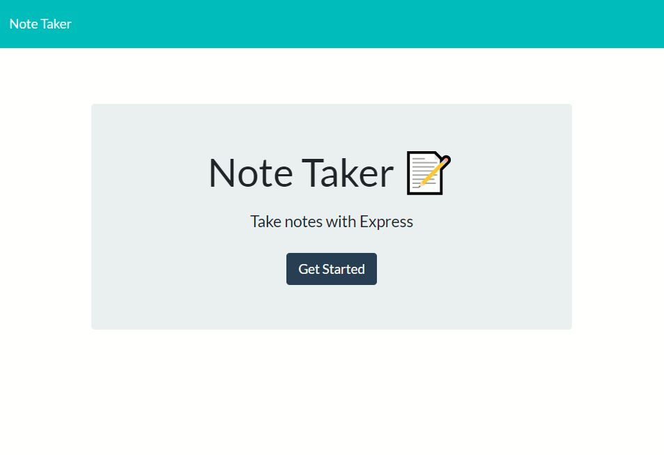
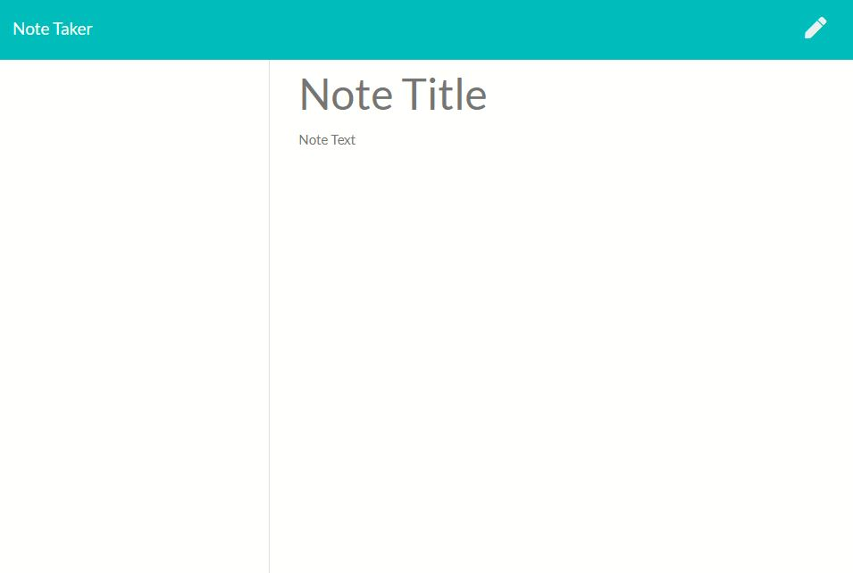
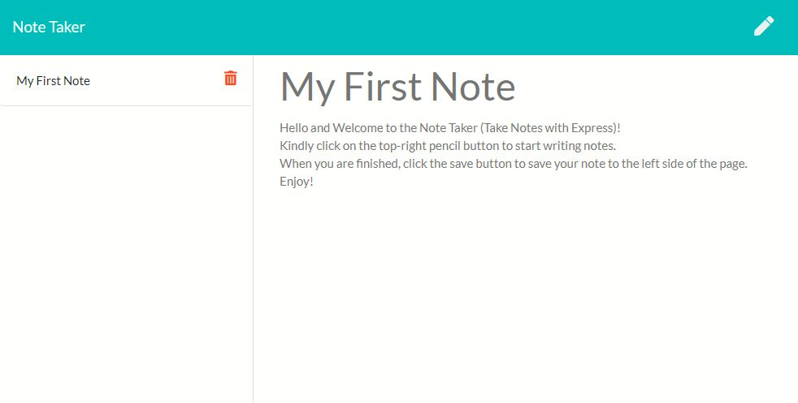

# Note Taker

# License
  

  

# Table of Contents

- [Description](#description)
- [Installation](#installation)
- [Contribution Guidelines](#contribution)
- [Usage](#usage)
- [Test Instructions](#test)

# Description
An interactive website where you can write, save and delete notes.  Acting like a virtual notepad, this note-taker can be operated without download by reviewing it in heroku application online. 

# Installation
No need for installment, just visit the website provided in the links below.

# Links
- Link to repository: https://github.com/itsrheine/note-taker
- Link to website: https://immense-wildwood-69263.herokuapp.com

# Usage 
- Visit this website: <a href="https://immense-wildwood-69263.herokuapp.com/">Note Taker App</a>
- In the welcome page, click 'Get Started'
- To create a note: Click the top-right pencil button.
- To save a note: Fill note title and note content.  A save button will appear on the top-right side of the browser.
- To delete a note: After saving the note, click the red trash button.
- Walkthrough Screencastify: <a href="https://youtu.be/okJShB2LpUQ">Click Me To Watch</a>

# Questions
If you have any questions or concerns, please feel free to reach out to my:
- Email: [mtiamsic@gmail.com](mtiamsic@gmail.com)
- Github: [itsrheine](https://github.com/itsrheine)

# Screenshot

  
